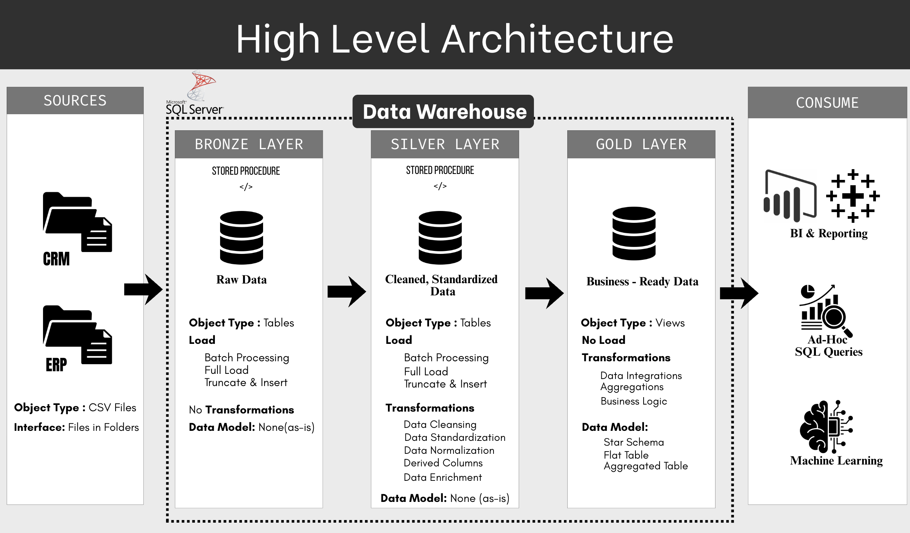
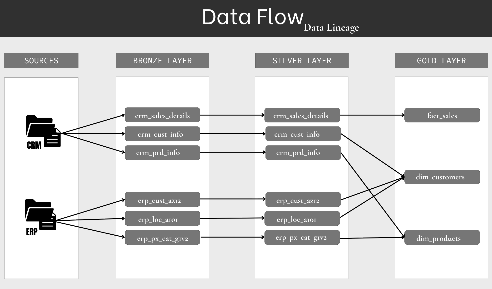
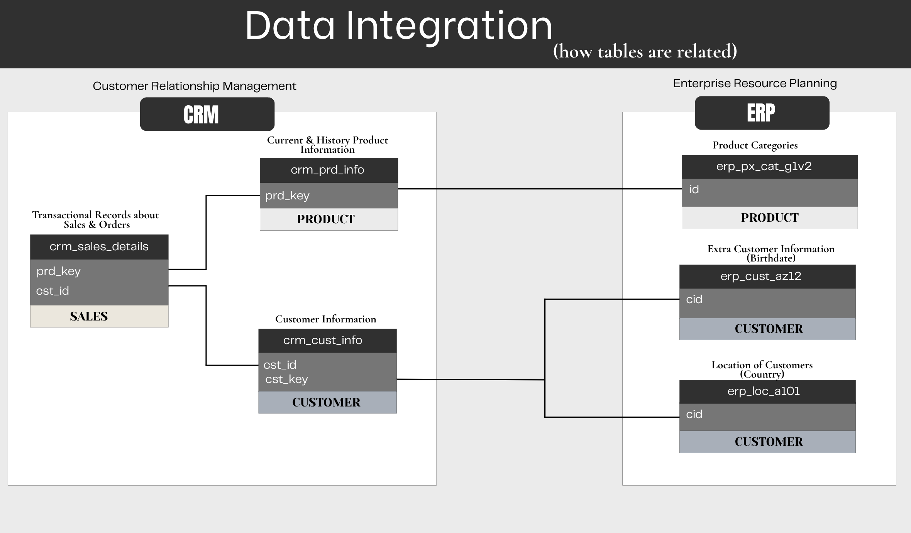
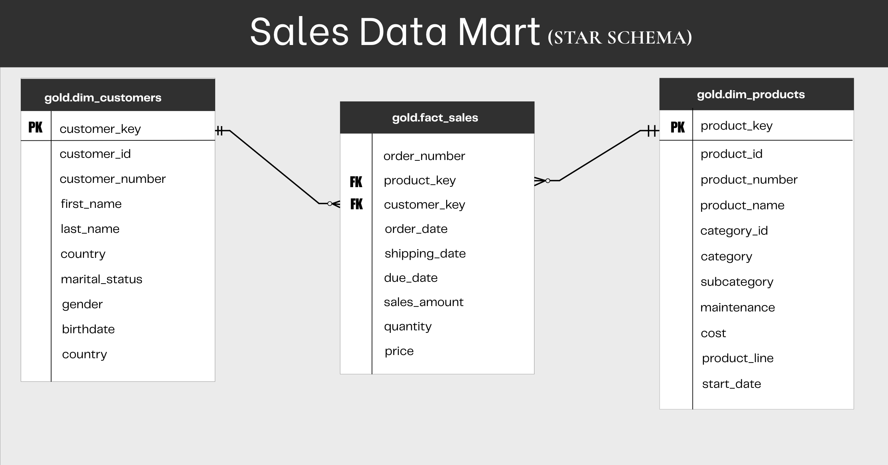

# 🏗️ CRM & ERP Data Warehouse

A SQL Server data warehouse built with a **Bronze–Silver–Gold architecture** to ingest, transform, integrate, and model CRM and ERP source data for analytical workloads.

`SQL Server` · `T-SQL` · `ETL` · `Medallion Architecture` · `Star Schema`

---

## 📌 Project Overview

This project demonstrates the development of a **SQL Server data warehouse** from raw CRM and ERP CSV files to a structured analytical model.

The warehouse follows a **Medallion Architecture**:

- 🥉 **Bronze** — Raw source data ingestion
- 🥈 **Silver** — Data cleansing, transformation, and validation
- 🥇 **Gold** — Integrated and business-ready analytical model

### Key Capabilities

- 📥 Ingest CRM and ERP CSV files into SQL Server
- 🔄 Build reusable T-SQL ETL procedures
- 🧹 Clean and standardize raw datasets
- ✅ Apply data quality and validation checks
- 🔗 Integrate related CRM and ERP data
- 📊 Build a Star Schema for analytical workloads
- 🗂️ Maintain a structured and documented data pipeline

---

## 🏗️ Data Architecture

The warehouse uses a **three-layer Medallion Architecture** to separate raw ingestion, transformation, integration, and analytical modeling.

### Data Flow

    CRM / ERP CSV Files
            │
            ▼
       🥉 Bronze
      Raw Ingestion
            │
            ▼
       🥈 Silver
     Clean & Transform
            │
            ▼
        🥇 Gold
      Integrate & Model
            │
            ▼
      Analytical Data

---

## 📂 Source Systems

The warehouse uses two source systems provided as CSV datasets.

| Source System | Data |
|---|---|
| **CRM** | Customers, Products, Sales Transactions |
| **ERP** | Customer Attributes, Locations, Product Categories |

The source files are maintained separately in the repository to preserve a clear connection between the original datasets and the warehouse ingestion process.

---

## 🥉 Bronze Layer — Raw Ingestion

The Bronze layer is the **raw data ingestion layer**.

Source CSV files are loaded into SQL Server **as-is**, without applying transformations or business rules. This preserves the original source structure for downstream processing.

### Responsibilities

- 📥 Load CRM and ERP CSV files
- 🗃️ Preserve original source data
- 🔁 Support repeatable data loading
- 🧱 Maintain raw staging tables
- ⏱️ Track load execution timing

CSV ingestion is handled using SQL Server's `BULK INSERT` functionality and reusable stored procedures.

---

## 🥈 Silver Layer — Transformation & Validation

The Silver layer converts raw Bronze data into **cleaned, standardized, and validated datasets**.

The focus of this layer is data preparation rather than cross-source integration.

### Processing Includes

- 🧹 Removing duplicate records
- 🔤 Standardizing values and formats
- 📅 Converting and validating dates
- 🔢 Correcting data types
- ⚠️ Handling missing and invalid values
- 🔍 Applying data-quality rules
- 🧮 Transforming product and sales attributes
- ✅ Validating transformed records

The result is a consistent and reliable representation of the source data for downstream modeling and integration.

---

## 🔗 Data Integration

The CRM and ERP datasets contain related business entities that are brought together during the analytical modeling process.

The integration process identifies relationships between source entities and combines the required attributes to create a consistent business view.

This allows information such as **customer details, locations, product categories, products, and sales transactions** to be represented within a unified analytical model.

---

## 🥇 Gold Layer — Analytical Model

The Gold layer contains the **business-ready analytical model** built from the transformed and integrated data.

The data is organized using a **Star Schema** consisting of dimension and fact tables.

### Gold Objects

| View | Purpose |
|---|---|
| `gold.dim_customers` | Customer attributes and descriptive information |
| `gold.dim_products` | Product attributes and descriptive information |
| `gold.fact_sales` | Sales transactions and measurable business metrics |

The dimension views provide descriptive business context, while the fact view stores measurable sales events.

---

## 📊 Data Model

The Gold layer follows a **Star Schema** designed to simplify analytical queries and provide clear relationships between business entities.

The model brings together customer, product, category, and sales information through dimension and fact relationships.

---

## 🔄 ETL Workflow

The complete pipeline follows a structured **Extract → Transform → Load** workflow.

| Layer | Process |
|---|---|
| **Bronze** | Extract and load raw CRM & ERP CSV files |
| **Silver** | Clean, standardize, transform, and validate data |
| **Gold** | Integrate transformed data and build the analytical model |

### Pipeline Flow

    Source CSV Files
          │
          ▼
    Extract & Load
          │
          ▼
       🥉 Bronze
          │
          ▼
    Transform & Validate
          │
          ▼
       🥈 Silver
          │
          ▼
     Integrate & Model
          │
          ▼
        🥇 Gold
          │
          ▼
    Analytical Queries

---

## 🧹 Data Quality

Data quality checks are applied during the transformation and modeling process to improve the reliability of the analytical layer.

### Checks Include

- Null and missing values
- Duplicate business keys
- Invalid date ranges
- Inconsistent data formats
- Invalid product and customer attributes
- Sales calculation consistency
- Dimension key uniqueness
- Fact-to-dimension relationships

These checks help ensure that validated and consistent data reaches the Gold layer.

---

## 🧠 Key Engineering Decisions

### Layered Architecture

Separating ingestion, transformation, integration, and analytical modeling makes the pipeline easier to maintain and extend.

### Source Preservation

Bronze data remains unchanged so the original source information is available for validation and reprocessing.

### Transformation Isolation

Data cleansing and standardization are handled in Silver without modifying the raw source layer.

### Data Integration

Related CRM and ERP entities are brought together to create a consistent analytical representation of the business.

### Dimensional Modeling

A Star Schema is used in Gold to simplify analytical queries and provide clear relationships between business entities.

### Surrogate Keys

Dimension surrogate keys provide stable identifiers for relationships between dimensions and fact data.

### Data Quality Controls

Validation is performed throughout the transformation and modeling process to improve consistency and reliability.

---

## 🛠️ Technology Stack

| Technology | Purpose |
|---|---|
| **Microsoft SQL Server** | Data warehouse platform |
| **T-SQL** | SQL development and ETL logic |
| **BULK INSERT** | CSV data ingestion |
| **Stored Procedures** | Reusable ETL operations |
| **SQL Tables & Views** | Bronze, Silver, and Gold data storage |
| **Git** | Version control |
| **GitHub** | Source code and project documentation |

---

## 📁 Repository Structure

    crm-erp-datawarehouse/
    │
    ├── datasets/
    │   ├── source_crm/
    │   │   ├── cust_info.csv
    │   │   ├── prd_info.csv
    │   │   └── sales_details.csv
    │   │
    │   └── source_erp/
    │       ├── cust_az12.csv
    │       ├── loc_a101.csv
    │       └── px_cat_g1v2.csv
    │
    ├── scripts/
    │   ├── bronze/
    │   │   ├── ddl_bronze.sql
    │   │   └── sp_load_bronze.sql
    │   │
    │   ├── silver/
    │   │   ├── ddl_silver.sql
    │   │   └── sp_load_silver.sql
    │   │
    │   └── gold/
    │       └── ddl_gold.sql
    │
    ├── tests/
    │   ├── silver_quality_checks.sql
    │   └── gold_quality_checks.sql
    │
    ├── docs/
    │   ├── data_architecture.png
    │   ├── data_flow.png
    │   ├── data_integration.png
    │   ├── data_model.png
    │   ├── data_catalog.md
    │   └── naming_conventions.md
    │
    └── README.md

---

## 🎯 Project Outcome

This project demonstrates an end-to-end **SQL Server data engineering workflow** covering:

**Raw Data Ingestion → Data Transformation → Data Quality → Data Integration → Dimensional Modeling → Analytical Data Warehouse**

The resulting warehouse provides a structured foundation for analytical queries across **customers, products, categories, and sales**.
